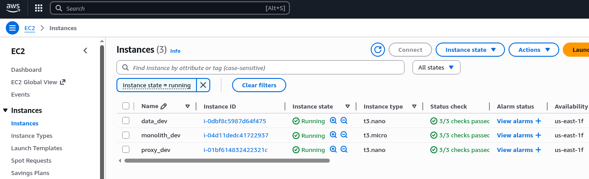

# Hedera-based prediction market

This project is divided into a number of folders:

- `scs`: on-chain smart contracts
- `clob`: an off-chain CLOB which matches cryptographically signed buy/sell order intents
- `infra`: infrastructure-as-code (AWS-orientated)
- `web`: a web front-end
- `web.eng`: an engineering front-end
- `api`: an API backend
- `proxy`: a proxy to marshall traffic
- `eventbus`: event bus for pub/sub message communication
- `resources`: a version-controlled area to store artifacts, design files, images, etc.
- `scripts`: some general usage scripts

## Quickstart (docker-compose)

```bash
# load all env vars
source ./api/loadEnv.sh local
source ./clob/loadEnv.sh local
source ./db/loadEnv.sh local
source ./eventbus/loadEnv.sh local
source ./proxy/loadEnv.sh local # note: local2
# source ./web/loadEnv.sh local # note: the web app is zero config

# now do:
docker compose -f docker-compose-proxy.yml up -d
docker compose -f docker-compose-data.yml up -d
docker compose -f docker-compose-monolith.yml up -d
```

Access the application at:

| Environment | URI                        |
|-------------|----------------------------|
| `local`     | http://localhost:8090      |
| `dev`       | https://dev.prism.market   |
| `uat`       | https://uat.prism.market   |
| ...         | ...                        |
| `prod`      | https://prism.market       |

## Quickstart (local machine)

Develop the application locally:

- `db`: see db/README.md
- `eventbus`: see [eventbus/README.md](eventbus/README.md)
- `api`: see [api/README.md](api/README.md)
- `clob`: see [clob/README.md](clob/README.md)
- `web`: see [web/README.md](web/README.md)
- `proxy`

## yaak/Postman

Please use [yaak](https://yaak.app/) for graphical requests to the following services:

- `api`
- `clob`

There is a yaak collection checked in `yaak.json`

## Sync

Note on syncing:

The following files and documentation notes MUST be kept in sync. If you add/remove/change a config or secret, please ensure it's documented and is reflected everywhere else.

`docker-compose-data.yml`
 - db/Dockerfile
 - db/.config*
 - db/.secrets
 - eventbus/Dockerfile
 - eventbus/.config*
 - eventbus/.secrets

`docker-compose-monolith.yml`
 - api/Dockerfile
 - api/.config*
 - api/.secrets
 - clob/Dockerfile
 - clob/.config*
 - clob/.secrets

`docker-compose-proxy.yml`
 - proxy/Dockerfile
 - proxy/.config*
 - proxy/.secrets (if applicable)

## Infra components

Infra design:


AWS (dev):



For further information, see the infra [README](infra/README.md)

## Versioning

Each service MUST be versioned.

Semver (semantic versioning) MUST be used.

For example, build a new docker image using the service NAME and the latest VERSION:

```bash
export NAME=eventbus
export VERSION=0.1.0
```

*Note: NAME must be one of {api, clob, db, eventbus, proxy, web, web.eng}*

`docker build -t ghcr.io/prismmarketlabs/${NAME}$:${VERSION} .`

`docker push ghcr.io/prismmarketlabs/${NAME}:$(VERSION)`

*Note: the latest version doesn't just get deployed automatically - a release is assembled together using a number of known-to-be stable service versions*

*Note: version numbers should never go down, always advancing*

## Docker container registry

Please use ghcr (Github container registry) only for images.

https://github.com/orgs/PrismMarketLabs/packages

Create a PAT here: https://github.com/settings/tokens/new - check `read:packages`, `write:packages` and `delete:packages`

Call the token "ghcr"

```bash
 export PAT=ghp_...
echo $PAT | docker login ghcr.io -u zoikhash --password-stdin # note: use your github username, "zoikhash" in this case
# you may have to install `pass` and `docker-credential-pass`
# or delete '{ "credsStore": "pass" }' from ~/.docker/config.json
```

Docker build instructions are at the top of the Dockerfiles

```bash
docker build -t ghcr.io/prismmarketlabs/envoy:0.1.0 . # Note the org name is all lowercase. Note the verison number
docker push ghcr.io/prismmarketlabs/envoy:0.1.0
```

```bash
export PAT=<personal_access_token>
echo $PAT | docker login ghcr.io --username MuzanHash --password-stdin

# example push:
docker push ghcr.io/NAMESPACE/IMAGE_NAME:v0.0.3
```

All (tagged) images should be pushed to this location.

All images **must** use [semantic versioning](https://semver.org/).

## Releases

All releases are specified in `docker-compose-SERVICE.ENV.yml` override files.

[Semantic versioning](https://semver.org/) **must** be used.

There is an **intentional separation** between **configuration** (`.config.ENV`) and **secrets** (`secrets`):

```bash
# Safe to check-in these files
.config
.config.local
.config.dev
.config.prod
```

```bash
# Safe to check-in these files, however, do NOT check in the secret itself. Only checkin the references to the secret on `aws ssm`
.secrets # environment is handled by `source loadEnv.sh local`
```

**N.B. do NOT check in secrets - only check-in references to secrets**

## Release procedure

View all the images here: https://github.com/orgs/PrismMarketLabs/packages

**Please do NOT push tagged images that were built locally/manually**

On your local machine, pull the image you want to tag:

```bash
# first set these three env vars:
export IMAGE=ghcr.io/prismmarketlabs/api
export VER_SRC=456091bd553e2b3cf073da1bf8a6b2e0a03f6521@sha256:a13f15a06ab618da1da78f5dd2e08768fcdd155cdb80d0ba1ccdb546eb099a5e
export VER_DST=0.1.1

docker pull $IMAGE:$VER_SRC
# may need to make an exception here for web/web.eng/etc.
docker tag $IMAGE:$VER_SRC $IMAGE:$VER_DST

docker images | grep $IMAGE
```

Now do:

```bash
docker push $IMAGE:$VER_DST
```

And update the docker-compose-<SERVICE>.<ENV>.yml with the new version.

### AWS secrets

Use `aws ssm` to store and retrieve secrets for a particular environment.

View all secrets

```bash
cat `find . -name ".secrets*"` | sort | uniq

aws ssm describe-parameters --parameter-filters Key=Type,Values=SecureString | grep "Name" | grep local
```

Store a secret:

```bash
export ENV=local
 aws ssm put-parameter --name "/$ENV/DB_PWORD" --value "XXXX" --type SecureString --overwrite
```

Retrieve all secrets:

```bash
export ENV=local
aws ssm get-parameters-by-path --path "/$ENV" | grep "Name"
```

Or...

```bash
aws ssm describe-parameters --query "Parameters[?Type=='SecureString'].Name" --output text
```

Retrieve a secret:

```bash
export ENV=local
aws ssm get-parameter --name "/$ENV/DB_PWORD" --with-decryption
```

Delete a secret:

```bash
export ENV=local
aws ssm delete-parameter --name "/$ENV/DB_PWORD"
```

### local

```bash
# load all config/secrets:
source ./api/loadEnv.sh local
source ./clob/loadEnv.sh local
source ./db/loadEnv.sh local
source ./eventbus/loadEnv.sh local
source ./proxy/loadEnv.sh local

docker compose -f docker-compose-proxy.yml up -d
docker compose -f docker-compose-monolith.yml up -d
docker compose -f docker-compose-data.yml up -d
```

### dev

Login to each of the dev boxes. Run:

```bash
# On Proxy:
source ./proxy/loadEnv.sh dev
docker compose -f docker-compose-proxy.yml -f docker-compose-proxy.dev.yml up -d
# On Monolith:
source ./api/loadEnv.sh dev
source ./clob/loadEnv.sh dev
docker compose -f docker-compose-monolith.yml -f docker-compose-monolith.dev.yml up -d
# On Data:
source ./db/loadEnv.sh dev
source ./eventbus/loadEnv.sh dev
docker compose -f docker-compose-data.yml -f docker-compose-data.dev.yml up -d
```

### prod

Login to each of the prod boxes. Run:

```bash
# On Proxy:
docker compose -f docker-compose-proxy.yml -f docker-compose-proxy.prod.yml up -d
# On Monolith:
source ./api/loadEnv.sh prod
source ./clob/loadEnv.sh prod
docker compose -f docker-compose-monolith.yml -f docker-compose-monolith.prod.yml up -d
# On Data
source ./db/loadEnv.sh prod
source ./eventbus/loadEnv.sh prod
docker compose -f docker-compose-data.yml -f docker-compose-data.prod.yml up -d
```

### docker

View container CPU/memory usage:

`docker stats`

View the env vars available in an image:

`docker run --env-file .config.local --rm ghcr.io/prismmarketlabs/db:$VERSION env`

In your Dockerfiles, try to avoid:

- ARG
- ENV
- "latest" images - use a specific version

### Screencast transcode

Reduce to 480p:

`ffmpeg -i 'Screencast from 2025-11-17 14-14-57.webm' -vf scale=1280:-1 -c:v libvpx-vp9 -crf 32 -b:v 0 -c:a libopus output.webm`

### diff

`gvimdiff`

### kubernetes

*Note: in the future, we may move to k8s*

The deployment prodecure would change in this case.

## hts

[Hedera Token Service](https://hedera.com/token-service) (hts) offers many potential advantages:

Potential advantages:

- near-zero tx fees (there may be interesting economic effects flowing from this)
- security: fewer lines of smart contract code (native tokens are at the protocol level, smart contract interfaces built rigorously by Hedera)
- ability to "pre-approve" funds up to a certain amount (as opposed to user having to "deposit" funds)
- no token association UX flow needed
- small dollar txs may encourage bots! (there may be a SPAM issue with this though...)
- etc.

Potential disadvantages:

- UI experience for the user due to [hts] token association requirements
- cluttering of user wallet with tokens (possible to use a single Fungible/NFT token?)
- ERC20-style smart contracts may cost more
- ERC20-style smart contracts may be incompatible with ed25519 key
- etc.

## Digital signatures

Every transaction initiated by the user has a digital signature.

`sig` is calculated based on the payload below (alphabetical ordering). The payload to construct a sig is a subset of the fields in `PredictionIntentRequest` in `api.proto`.

```golang
type ObjForSigning struct {
  BuySell                uint8 // buy is 0xf0, sell is 0xf1. Note: '0' and '1' doesn't work for technical reasons - odd number of bits in the register doesn't play well with keccak hashing algos. In Solidity (and many other languages), a bool gets encoded as 0x00 or 0x01 (a single byte)
  CollateralUsdAbsScaled uint256 // uint256 may seem a lot, but kept this way to reduce on-chain casting to uint256 (e.g. ERC20)
  EvmAdd                 address/uint160 // a 20-byte EVM address is 160-bits. Note: the evmAddress is fixed. It is derived *once* at account creation.
  MarketIdUUID           uint128
  TxIdUUID               uint128
}
```

The marketId, the amount under consideration and the initiator account (immutable evmAddress) are assembled together for signing. This assembly design prevents others from sending signed txs to the API that could be used elsewhere, replayed, etc.

See: `assemblePayloadHexForSigning(...)` in ./web.eng/lib/utils.ts

See: `AssemblePayloadHexForSigning(...)` in ./api/server/lib/sign.go
