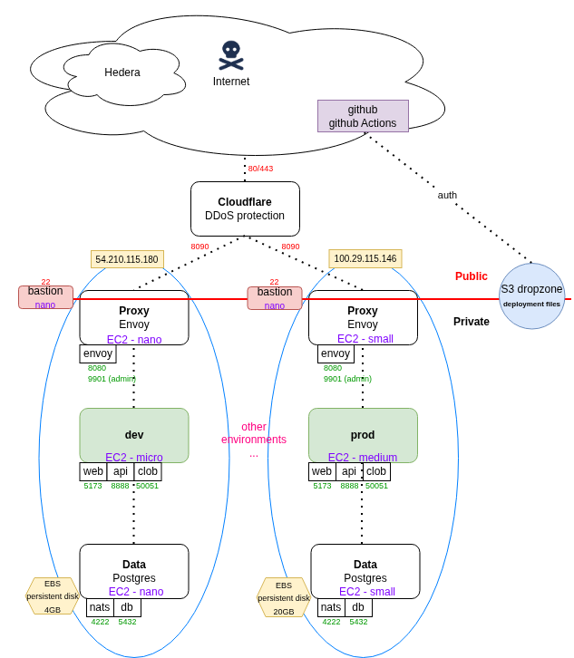

# infra

Cloud platform -agnostic infrastructure deployment files (Terraform)

There are 3 EC2 boxes deployed on AWS for each environment

| EC2 name  | Services             | Description                                                                 |
|-----------|----------------------|-----------------------------------------------------------------------------|
| proxy     | `proxy`              | Handles traffic routing and acts as an intermediary between services.       |
| monolith  | `web`, `api`, `clob` | A single, unified application containing multiple functionalities.          |
| data      | `eventbus`, `db`     | Manages storage, retrieval, and processing of application data.             |
| bastion   | n/a                  | Provides ssh access                                                         |

*Note: the proxy is behind an AWS load balancer*


Take note of the private subnets for each env:

| environment | hostname         | private subnet  |
|-------------|------------------|-----------------|
| dev         | dev.prism.market | 10.0.1.0/24     |
| uat         | uat.prism.market | 10.0.1.0/24     |
| prod        | prism.market     | 10.0.1.0/24     |

*Note: in future, we will use load balancers and not fixed IP addresses.*

### Quickstart

`./genEnvs.sh`

Follow the instructions to deploy to dev

`cd gen/dev`

`terraform apply`

## Manually-created resources

The following resources (static - not to be deleted) should be created manually for each env:

- DNS hosted zone on Route 53 (AWS)
- AWS certificates
- EBS (elastic block storage) for persistent data storage
- S3 bucket - a landing zone for deploying docker-compose* files
- AWS SES service
- ~~EIP (elastic IP address)~~

## DNS hosted zone

A DNS hosted zone has been set up.

The NS records provided by Amazon have been added to prism.market on namecheap.com

https://us-east-1.console.aws.amazon.com/route53/v2/hostedzones

hosted zone ID: `Z07868573V3HLWHKP9WV6`

## AWS certificates

| Environment | hostname         | arn                                                                                 |
|-------------|------------------|-------------------------------------------------------------------------------------|
| dev         | dev.prism.market | arn:aws:acm:us-east-1:063088900305:certificate/fdb39519-526b-48d2-a96e-307381465c05 |
| uat         | uat.prism.market | arn:aws:acm:us-east-1:063088900305:certificate/48dc07e4-d1c2-488e-a085-3e499893a4e4 |
| prod        | prism.market     | arn:aws:acm:us-east-1:063088900305:certificate/93dfad7f-8a67-43f3-a2e1-7f1f2f4b91c7 |

## AWS EBS resources

| Environment | Volume Id                   | Name            | Size   |
| ------------|-----------------------------|-----------------|--------|
| dev         | vol-0d3a782bdfffc34aa       | datamnt_dev     | 4GB    |
| uat         | vol-043410f6197ee2c31       | datamnt_uat     | 4GB    |
| prod        | vol-0e4912ca44f31c1f5       | datamnt_prod    | 20GB*  |

**backed up*

## S3 bucket

| Environent |  Name                | arn                                | region    | url                                                       |
| -----------|----------------------|------------------------------------|-----------|-----------------------------------------------------------|
| all        | prismlabs-deployment | arn:aws:s3:::prismlabs-deployment  | us-east-1 | https://prismlabs-deployment.s3.us-east-1.amazonaws.com/* |

A new S3 bucket called `prismlabs-deployment` has been set up.

One-time setup (clickops):

- Block all public access
- ACLs disabled (AWS IAM is used for access)
- Enable bucket key

Now create a new policy called `s3-landing-zone-policy` (so github Actions can add files to S3):

```json
{
  "Version": "2012-10-17",
  "Statement": [
    {
      "Sid": "AllowWriteToSpecificBucket",
      "Effect": "Allow",
      "Action": [
        "s3:PutObject",
        "s3:PutObjectAcl",
        "s3:AbortMultipartUpload",
        "s3:ListBucket"
      ],
      "Resource": [
        "arn:aws:s3:::prismlabs-deployment",
        "arn:aws:s3:::prismlabs-deployment/*"
      ]
    }
  ]
}
```

- Now create a new IAM user: IAM -> users
- Create user called `github-actions-s3-writer`
- Attach the policy `s3-landing-zone-policy` to `github-actions-s3-writer`
- Retrieve the access key (`AWS_ACCESS_KEY_ID` and `AWS_SECRET_ACCESS_KEY` for the user `github-actions-s3-writer`) from the AWS IAM web UI
- Add `AWS_ACCESS_KEY_ID` and `AWS_SECRET_ACCESS_KEY` to github "Repository secrets" https://github.com/PrismMarketLabs/Hedera-Prediction/settings/secrets/actions
- the github action `s3-upload.yml` should now run

### EC2 boxes accessing the files on S3

*Note: Terraform applies a (combined) policy (./infra/shared) to allow S3 reads to happen.*

`aws s3 ls s3://prismlabs-deployment/docker-compose`

## github PAT

*Note: Terraform applies a (combined) policy (./infra/shared) to allow ssm reads to happen.*

So `proxy`, `monolith` and `data` can pull images from ghcr.io, need to create a new github PAT.

Create a new PAT: https://github.com/settings/apps

- New personal access token (classic)
- scope: `read:packages`

On your laptop, save this PAT in the aws secrets manager:

`aws ssm put-parameter --name "read_ghcr" --value "XXXXXXXX" --type "SecureString" --region "us-east-1"`

Now, on the EC2 instance, can do (Terraform has already set the permsissions for you)

`aws ssm get-parameter --name "read_ghcr" --with-decryption --region "us-east-1"`

## AWS SES service

https://us-east-1.console.aws.amazon.com/ses/home?region=us-east-1

## AWS login

Login to AWS here:

https://063088900305.signin.aws.amazon.com/console

Make sure you have an AWS access key: https://us-east-1.console.aws.amazon.com/iam/home?region=us-east-1#/security_credentials?section=IAM_credentials

Have `aws` installed: https://aws.amazon.com/cli/

Then run:

`aws configure`

Use your AWS access key from above.

## Access the boxes

The terraform file has configured the boxes to require a specific key (e.g. `dev`, `dev-bastion`, etc.)

**Note: you cannot login directly from the Internet to `proxy`, `monolith` or `data`. You must connect via `bastion`.**

The `dev` key and `dev-bastion` key are .pem files (ed25519 key type) and were generated using the AWS Web UI:

https://us-east-1.console.aws.amazon.com/ec2/home?region=us-east-1#CreateKeyPair:

Please contact Ethan or the CTO to get the key to enable you to login.

**Do not share these keys! Do not check this file in to source code!**

To login without the keys ever leaving your laptop, do:

```bash
# start ssh agent:
eval "$(ssh-agent -s)"
# add the bastion key and the key for the internal boxes:
ssh-add ~/Desktop/dev-bastion.pem
ssh-add ~/Desktop/dev.pem
ssh-add ~/Desktop/uat-bastion.pem
ssh-add ~/Desktop/uat.pem
ssh-add ~/Desktop/prod-bastion.pem
ssh-add ~/Desktop/prod.pem
# Can now do:
ssh -A admin@<bastion_hostname_aws>
ssh -A admin@10.0.1.11
```

**Do NOT save keys on the bastion**

## Architecture

The system is designed with simplicity, cost and ease-of-use in mind.

Eventually we may move to kubernetes.

System design diagram:



## terraform

Init terraform (only have to do this once):

`cd` into the environment you want to deploy to (`dev`, `prod`, etc.)

`terraform init`

Deploy AWS resources:

`terraform apply`

--> N.B. view the output and update the namecheap.com NS records with the updated DNS entries

Tear down AWS resources:

`terraform destroy`

## AWS security groups

AWS limits the number of security groups that can be applied to a EC2 resource to 5.

Request an increase here (e.g. to 8): https://us-east-1.console.aws.amazon.com/servicequotas/home/services/vpc/quotas/L-2AFB9258
